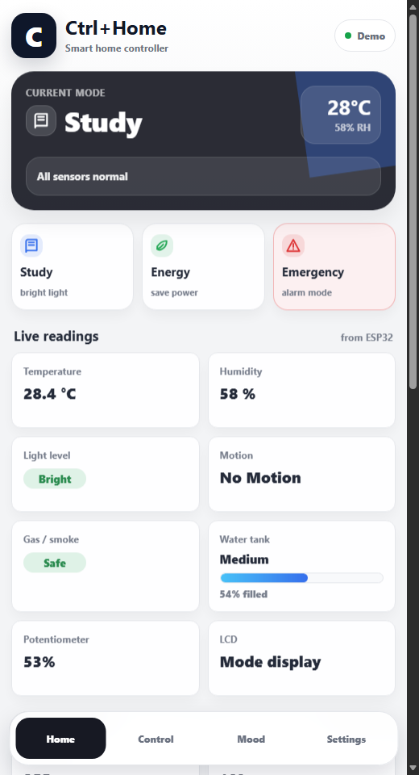

# Ctrl+Home — Smart Home IoT Dashboard

Ctrl+Home is a smart home IoT project using an **ESP32**, sensors, MQTT communication, and a mobile-friendly **HTML web dashboard**.  
The system monitors real-time room conditions, controls smart home devices, and reacts automatically to unsafe sensor readings.

---

## Project Structure

```text
Ctrl-Home/
│
├── assets/
│   ├── existing-flowchart.png
│   └── project-scoring-breakdown.png
│
├── diagrams/
│   └── IoT-diagram.png
│
├── report/
│   ├── Architecture_Explanation.md
│   └── Smart_Home_IoT_Final_Report.md
│
├── screenshots/
│   └── ctrlhome-demo-home.png
│
├── IOT_project.ino
├── README.md
├── SECURITY.md
└── index.html
```

---

## Project Overview

Ctrl+Home is designed as a smart home controller for an IoT course project.  
The ESP32 reads multiple sensors, sends data through MQTT, and receives control commands from the web dashboard.

The dashboard can be opened from a browser on a phone or laptop. It connects to the MQTT broker using MQTT over WebSocket and updates live sensor values in real time.

---

## Main Features

- Real-time sensor monitoring
- MQTT communication between ESP32 and dashboard
- Mobile-friendly web dashboard
- Manual control for outputs
- Smart room modes
- Custom mood settings
- Safety alerts
- Emergency mode
- Water tank loading bar
- Gas safety status
- Light level status
- Potentiometer percentage display
- Dark theme support

---

## Sensors Used

| Sensor | Purpose |
|---|---|
| DHT11 | Temperature and humidity |
| LDR | Light level |
| PIR Sensor | Motion detection |
| MQ-2 Sensor | Gas / smoke detection |
| Water Level Sensor | Water tank level |
| Potentiometer | Manual analog input |

---

## Output Devices

| Output | Purpose |
|---|---|
| Main light | Brightness control |
| Fan | Speed control |
| Servo motor | Curtain control |
| Buzzer | Alarm / emergency alert |
| Red LED | Emergency or mood LED |
| Green LED | Mood LED |
| Yellow LED | Mood LED |
| I2C LCD | Local status display |

---

## Technologies Used

| Technology | Purpose |
|---|---|
| ESP32 | Main microcontroller |
| Arduino IDE | ESP32 programming |
| HTML | Dashboard structure |
| CSS | Dashboard styling |
| JavaScript | Dashboard logic |
| MQTT.js | Browser MQTT WebSocket connection |
| PubSubClient | ESP32 MQTT communication |
| HiveMQ Public Broker | MQTT testing broker |
| I2C LCD | Local display |

---

## System Architecture

```text
Sensors → ESP32 → MQTT Broker → Web Dashboard
Web Dashboard → MQTT Broker → ESP32 → Output Devices
```

The ESP32 publishes sensor data to MQTT topics.  
The web dashboard subscribes to those topics and displays the values.  
When the user presses a control button, the dashboard publishes a command, and the ESP32 receives it.

See the full architecture explanation here:

```text
report/Architecture_Explanation.md
```

System diagram:

```md

```

---

## Web Dashboard

Main dashboard file:

```text
index.html
```

The dashboard includes four pages:

| Page | Description |
|---|---|
| Home | Shows current mode, alerts, live readings, and output status |
| Control | Controls light, fan, curtain, LEDs, and alarm |
| Mood | Creates and saves custom mood settings |
| Settings | Configures MQTT broker, device ID, notifications, and theme |

Dashboard screenshot:

```md

```

---

## ESP32 Code

Main ESP32 file:

```text
IOT_project.ino
```

The ESP32 code handles:

- WiFi connection
- MQTT connection
- Sensor reading
- MQTT publishing
- MQTT subscription
- Output control
- Smart mode logic
- Emergency safety logic
- LCD display messages

---

## MQTT Broker

The project uses HiveMQ public broker for testing.

### ESP32 MQTT

```text
broker.hivemq.com
Port: 1883
```

### Web Dashboard MQTT WebSocket

```text
wss://broker.hivemq.com:8884/mqtt
```

---

## Device ID

Default device ID:

```text
B6737115
```

Base MQTT topic:

```text
ctrlhome/B6737115
```

The dashboard allows the user to change the device ID in the Settings page.

---

## MQTT Topics

### Sensor Topics

```text
ctrlhome/B6737115/temperature
ctrlhome/B6737115/humidity
ctrlhome/B6737115/light
ctrlhome/B6737115/motion
ctrlhome/B6737115/gas
ctrlhome/B6737115/water
ctrlhome/B6737115/potentiometer
ctrlhome/B6737115/alert
ctrlhome/B6737115/currentmode
```

### Control Topics

```text
ctrlhome/B6737115/mode
ctrlhome/B6737115/light/control
ctrlhome/B6737115/fan/control
ctrlhome/B6737115/curtain/control
ctrlhome/B6737115/alarm/control
```

### Custom Mood Topics

```text
ctrlhome/B6737115/custom/brightness
ctrlhome/B6737115/custom/rgb
ctrlhome/B6737115/custom/fan
ctrlhome/B6737115/custom/curtain
ctrlhome/B6737115/custom/alarm
ctrlhome/B6737115/custom/temp
```

### Status Topics

```text
ctrlhome/B6737115/status/light
ctrlhome/B6737115/status/fan
ctrlhome/B6737115/status/curtain
ctrlhome/B6737115/status/rgb
ctrlhome/B6737115/status/alarm
```

---

## Smart Modes

| Mode | Description |
|---|---|
| Manual | User controls outputs manually |
| Sleep | Dim/quiet room mode |
| Study | Bright room setup for studying |
| Relax | Soft light and comfort setup |
| Away | Security monitoring mode |
| Energy | Reduced power usage |
| Emergency | Alarm, full light, high fan, and red warning LED |
| Comfort | Custom mood mode |

---

## Sensor Display Logic

### Light Level

| LDR Value | Status |
|---:|---|
| Below 1200 | Bright |
| 1200 to 2799 | Dim |
| 2800 and above | Dark |

### Gas Safety

| Gas Value | Status |
|---:|---|
| Below 1200 | Safe |
| 1200 to 1999 | Warning |
| 2000 and above | Danger |

### Water Tank

| Percentage | Status |
|---:|---|
| Below 10% | Empty |
| 10% to 34% | Low |
| 35% to 69% | Medium |
| 70% to 89% | Almost Full |
| 90% and above | Full |

---

## How to Run

### 1. Upload ESP32 Code

Open this file in Arduino IDE:

```text
IOT_project.ino
```

Update WiFi credentials:

```cpp
const char* ssid = "YOUR_WIFI_NAME";
const char* password = "YOUR_WIFI_PASSWORD";
```

Upload the code to the ESP32.

### 2. Open Dashboard

Open:

```text
index.html
```

You can open it directly in a browser or publish it using GitHub Pages.

### 3. Connect MQTT

Go to the dashboard Settings page and press **Connect**.

Check that the broker is:

```text
wss://broker.hivemq.com:8884/mqtt
```

Check that the Device ID matches the ESP32 topic ID:

```text
B6737115
```

---

## Report Files

The project report files are stored in:

```text
report/
```

| File | Description |
|---|---|
| `Architecture_Explanation.md` | Technical architecture explanation |
| `Smart_Home_IoT_Final_Report.md` | Final course report |

---

## Assets and Diagrams

| Folder | Description |
|---|---|
| `assets/` | Project flowchart and scoring breakdown images |
| `diagrams/` | IoT architecture diagram |
| `screenshots/` | Dashboard screenshots |

---

## Security Notice

This project uses a public MQTT broker for testing.  
Do not upload real WiFi passwords or private credentials to GitHub.

Read:

```text
SECURITY.md
```

---

## Future Improvements

- Add private MQTT broker
- Add MQTT username and password
- Add TLS security
- Add database for sensor history
- Add charts
- Add login system
- Add mobile app version
- Add Node-RED integration
- Add push notifications
- Add cloud deployment

---

## Author

**Sokvisal Leng**

---

## License

This project is for educational purposes only.
